# Credit_Risk_Analysis

## Resources
python 3.7.9; pandas, sklearn and imblearn libraries; jupyter notebook; csv of loan statistics for 2019 first quarter

## Overview

The purpose of this project is use data on loans from 2019 to develop a machine learning model to predict if a future loan applicant is high risk or low risk to default on the loan.  

Using pandas I extracted and transforme the data from the csv, converting the target 'loan_status' column values into either 'high risk' or 'low risk' depending on whether payments toward the loan were behind in some way, or if they were current.  I then converted featurescolumns with text--such as current home ownership status and any hardship flags--into numerical values that could be interpreted by the machine learning algorithm.  I then separated the data into columns for features, and a target column containing a status of 'high risk' or 'low risk'.  I then split the data into training and testing sets.

Because the classes of low risk and high risk were so imbalanced, I tested several over-sampling and under-sampling models to get their accuracy, precision, and recall scores, as seen in the credit_risk_resampling.ipynb file.

I also then tested two ensemble classifier models to determine their accuracy, precision, and recall scores, as seen in the credit_risk_ensemble.ipynb file.

## Results

### Resampling Models Results

- Random Oversampling Model Results

    - Accuracy Score: 0.66
    
    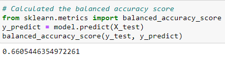

    - High Risk Precision Score: 0.01

    - Low Risk Precision Score: 1.00

    - High Risk Recall Score: 0.68

    - Low Risk Recall Score: 0.64

    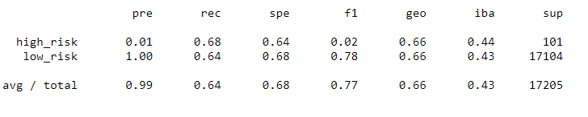

- Oversampling with SMOTE Model Results

    - Accuracy Score: 0.655
    
    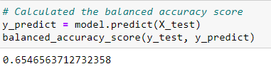

    - High Risk Precision Score: 0.01

    - Low Risk Precision Score: 1.00

    - High Risk Recall Score: 0.61

    - Low Risk Recall Score: 0.70

    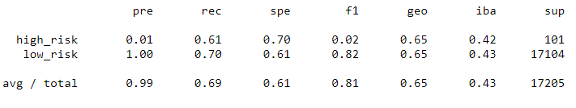

- Undersampling with Clustered Centroid Model Results

    - Accuracy Score: 0.545
    
    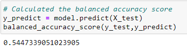

    - High Risk Precision Score: 0.01

    - Low Risk Precision Score: 1.00

    - High Risk Recall Score: 0.69

    - Low Risk Recall Score: 0.40

    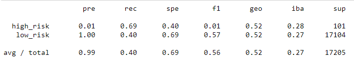

- Combined Over/Undersampling with SMOTEENN Model Results

    - Accuracy Score: 0.642
    
    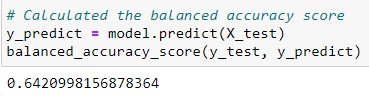

    - High Risk Precision Score: 0.01

    - Low Risk Precision Score: 1.00

    - High Risk Recall Score: 0.71

    - Low Risk Recall Score: 0.57

    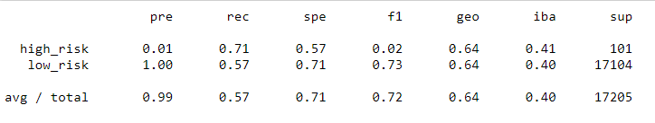

### Ensemble Classifier Models Results
    
- Balanced Random Forest Classifier Model Results

    - Accuracy Score: 0.789
    
    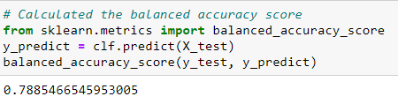

    - High Risk Precision Score: 0.03

    - Low Risk Precision Score: 1.00

    - High Risk Recall Score: 0.70

    - Low Risk Recall Score: 0.87

    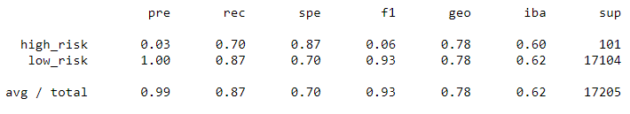

- Easy Ensemble Classifier Model Results

    - Accuracy Score: 0.931
    
    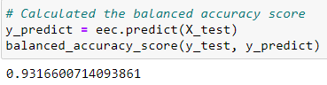

    - High Risk Precision Score: 0.09

    - Low Risk Precision Score: 1.00

    - High Risk Recall Score: 0.92

    - Low Risk Recall Score: 0.94

    

## Summary

In general, all the resampling models performed more poorly than the two ensemble classifier models, with resampling models all having lower accuracy, precision, and recall scores than the the ensemble classifier models.  Of the two ensemble methods, the Easy Ensemble Classifier Model would be the best choice of these models to use in predicting future risk for future applicants.  The Easy Ensemble Classifier Model had the highest Accuracy Score at .931, but more importantly, it had the highest Recall scores for High Risk and Low Risk.  In this case, the Recall score for High Risk class is the most telling statistic.  Because the large majority of cases are low risk, having an overall accuracy score could be achieved by predicting many cases as low risk, and identifying very few if any actual high risk cases.  Having a strong High Risk Recall Score shows that the Easy Ensemble Classifier Model will identify 92% of the high risk cases.  Additionaly, the Low Risk Recall Score for this model is strong, indicating that the model will not incorrectly deny loans to very many applicants who are not high risk.  Thus this model will best identify which applicants to turn down for a loan without sacrificing the oppurtunity to approve worthy applicants.

