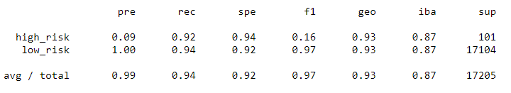

# Credit_Risk_Analysis

## Resources
python 3.7.9; pandas, sklearn and imblearn libraries; jupyter notebook; csv of loan statistics for 2019 first quartet 

## Overview

The purpose of this project is use data on loans from 2019 to develop a machine learning model to predict if a future loan applicant is high risk or low risk to default on the loan.  

Using pandas I extracted and transforme the data from the csv, converting the target 'loan_status' column values into either 'high risk' or 'low risk' depending on whether payments toward the loan were behind in some way, or if they were current.  I then converted featurescolumns with text--such as current home ownership status and any hardship flags--into numerical values that could be interpreted by the machine learning algorithm.  I then separated the data into columns for features, and a target column containing a status of 'high risk' or 'low risk'.  I then split the data into training and testing sets.

Because the classes of low risk and high risk were so imbalanced, I tested several over-sampling and under-sampling models to get their accuracy, precision, and recall scores.

I also then tested two ensemble classifier models to determine their accuracy, precision, and recall scores.

## Results

### Resampling Models Results

- Random Oversampling Model Results

    - Accuracy Score: 0.66
    
    

    - High Risk Precision Score: 0.01

    - Low Risk Precision Score: 1.00

    - High Risk Recall Score: 0.68

    - Low Risk Recall Score: 0.64

    

- Oversampling with SMOTE Model Results

    - Accuracy Score: 0.655
    
    

    - High Risk Precision Score: 0.01

    - Low Risk Precision Score: 1.00

    - High Risk Recall Score: 0.61

    - Low Risk Recall Score: 0.70

    

- Undersampling with Clustered Centroid Model Results

    - Accuracy Score: 0.545
    
    

    - High Risk Precision Score: 0.01

    - Low Risk Precision Score: 1.00

    - High Risk Recall Score: 0.69

    - Low Risk Recall Score: 0.40

    

- Combined Over/Undersampling with SMOTEENN Model Results

    - Accuracy Score: 0.642
    
    

    - High Risk Precision Score: 0.01

    - Low Risk Precision Score: 1.00

    - High Risk Recall Score: 0.71

    - Low Risk Recall Score: 0.57

    

### Ensemble Classifier Models Results
    
- Balanced Random Forest Classifier Model Results

    - Accuracy Score: 0.789
    
    

    - High Risk Precision Score: 0.03

    - Low Risk Precision Score: 1.00

    - High Risk Recall Score: 0.70

    - Low Risk Recall Score: 0.87

    

- Easy Ensemble Classifier Model Results

    - Accuracy Score: 0.931
    
    

    - High Risk Precision Score: 0.09

    - Low Risk Precision Score: 1.00

    - High Risk Recall Score: 0.92

    - Low Risk Recall Score: 0.94

    